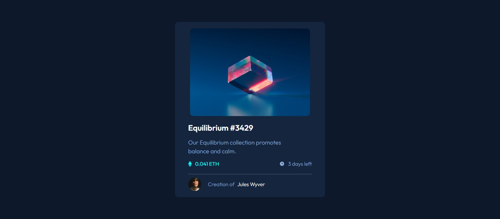

# Frontend Mentor - NFT preview card component solution

This is a solution to the [NFT preview card component challenge on Frontend Mentor](https://www.frontendmentor.io/challenges/nft-preview-card-component-SbdUL_w0U).

## Table of contents

- [Overview](#overview)
  - [The challenge](#the-challenge)
  - [Screenshot](#screenshot)
  - [Links](#links)
- [My process](#my-process)
  - [Built with](#built-with)
- [Author](#author)

## Overview

### The challenge

Users should be able to:

- View the optimal layout depending on their device's screen size
- See hover states for interactive elements

### Screenshot

### Links

- [Solution URL](https://github.com/obinneji/NFT-Preview-card-component)
-[Live Site URL](https://obinneji.github.io/NFT-Preview-card-component/)

## My process

### Built with

- Semantic HTML5 markup
- CSS custom properties
- Flexbox

## Author

- Website - [obinneji](https://www.github.com/obinneji)
- Frontend Mentor - [@obinneji](https://www.frontendmentor.io/profile/obinnnrji)
- Twitter - [@francisobinneji](https://www.twitter.com/francisobinneji)
